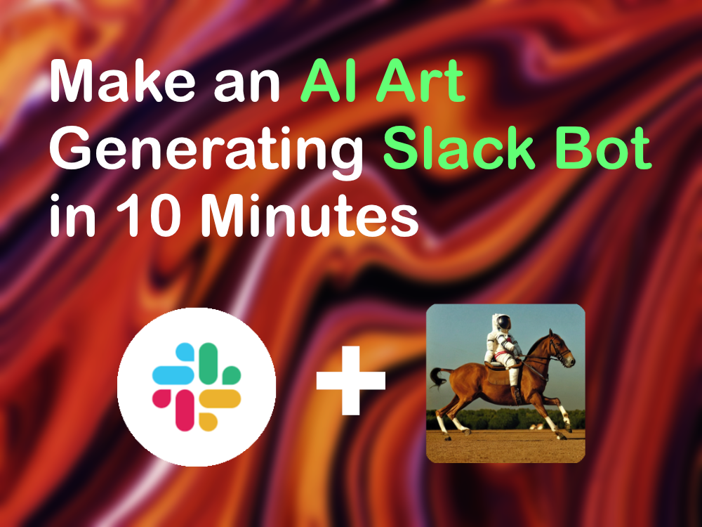
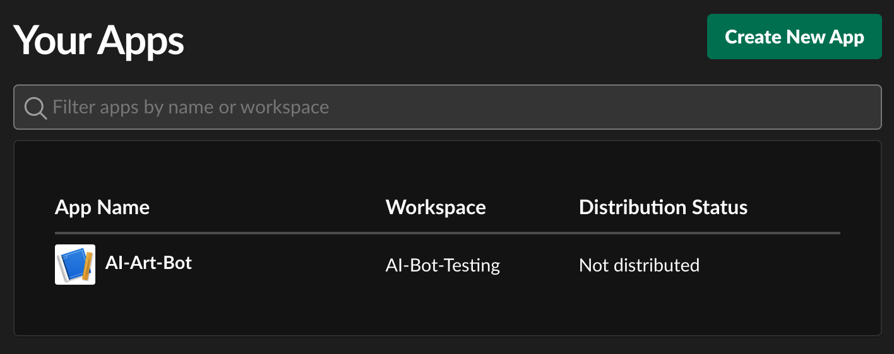
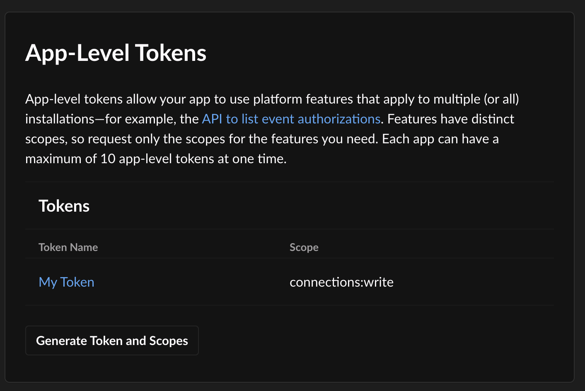
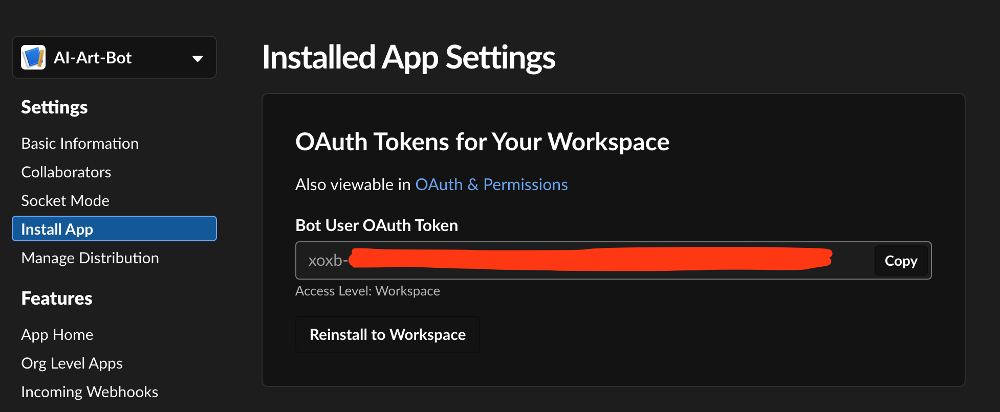
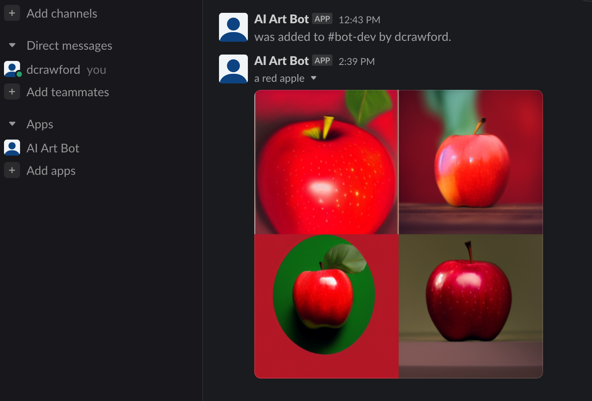

# Make an AI Art Generating Slack Bot in 10 Minutes



AI art generation has been exploding in the last year, and the once difficult to manage tools are now incredibly easy to use, modular, and versatile. Last year I created a Discord bot that generated AI art from my own privately hosted DALL-E 2 public model. This was quite cumbersome to setup, and it wasn't very flexible if I wanted to make small changes. After exploring what's changed in the last year, I can confidently say that all of my pain points have been resolved by the latest iteration of art generation: [Stable Diffusion](https://stablediffusionweb.com/). In this post, I wanted to share how easy it truly is to create your own AI art generating Slack bot. I chose Slack this time, because at Michigan Labs we use Slack as our communication tool, so it's a little more relevant to our own work. But there is a lot of overlap between Slack and Discord, if you're using their respective Typescript libraries. With that said, start your timer, because this should only take about 10 minutes (as long as your internet speed is fast enough!).

### Requirements

You just need a computer with a 4GB+ GPU.
   
You can use Linux or Apple Silicon, but it's a bit easier (with respect to NVIDIA drivers) with Windows. For my setup, I like modularity and low-profile hardware. I use the following:

1. [Intel NUC 8](https://www.amazon.com/gp/product/B07GX4X4PW) - One of the few mini PCs that has Thunderbolt support
2. [Razer Core X](https://www.amazon.com/gp/product/B07CQG2K5K) - This is an excellent plug-and-play enclosure that uses Thunderbolt
3. RTX 3080 - This generates about one image per second, which has been plenty fast for my needs

### Getting Started

Next, you'll need to install a couple dependencies and activate a new Slack application.

#### The Stable Diffusion Web UI

[This](https://github.com/AUTOMATIC1111/stable-diffusion-webui) is a project that gives us more than what we're trying to accomplish, but that's a good thing! It's highly extensible, with tons of options for adding more models and customizations. It can also provide a really great web frontend to interact with your hosted model. For our Slack bot purposes however, follow these steps to get it ready for a different interface:

1. Install all of the [dependencies](https://github.com/AUTOMATIC1111/stable-diffusion-webui/wiki/Dependencies) from the Web UI readme (the git repo, Python 3.10+, and the Stable Diffusion 4GB model)
   
2. Go into the `stable-diffusion-webui` repo and open `webui-user.bat`, and change the `COMMANDLINE_ARGS` so that your file looks like this:

```bat
@echo off

set PYTHON=
set GIT=
set VENV_DIR=
set COMMANDLINE_ARGS=--api --nowebui --listen

call webui.bat
```

- `--api` tells the web UI to generate a swagger doc at the server's `<IP>/doc` website path. This is optional, but helpful when you're trying to learn about what your new api can do
- `--nowebui` makes it start a bit faster by skipping the frontend. This is optional
- `--listen` tells the api server to run on the local network, instead of the local host. This is required for our Slack bot to be able to access it

3. Run `webui-user.bat` and the server should start up in a command prompt window

To verify that it's running properly, try going to `<IP_ADDRESS>:7861/docs` in a browser. You should see a Swagger UI page.

#### The Slack Bot

Next, we'll create a very simple Slack application using Typescript. This bot will be invoked in a Slack channel by typing `/art <PROMPT>`, and the bot will reply with the result from our Stable Diffusion model.

1. Make sure you have [Node.js](https://nodejs.org/en/) installed

2. Clone my [bare-bones Typescript Slack bot template](https://github.com/DaveAldon/AI-Art-Slack-Bot) to follow along quicker

```bash
git clone https://github.com/DaveAldon/AI-Art-Slack-Bot
```

3. Inside this repo, install the dependencies with a quick `npm install`. Then create an `.env` file that matches the `.env.example` file. For the `BACKEND_URL` field, add your Stable Diffusion server's IP address and port like this: `http://<IP>:7861`. The API runs on port 7861 by default

4. Go to the [Slack application dashboard](https://api.slack.com/apps), and create a new app *from an app manifest*. This will make configuration easier



You can use the manifest I used for this basic example below:

```yaml
display_information:
  name: AI-Art-Bot
features:
  bot_user:
    display_name: AI Art Bot
    always_online: false
  slash_commands:
    - command: /art
      description: Get AI generated art from your prompt
      should_escape: false
oauth_config:
  scopes:
    bot:
      - commands
      - users:read
      - files:write
settings:
  interactivity:
    is_enabled: true
  org_deploy_enabled: false
  socket_mode_enabled: true
  token_rotation_enabled: false
```

We need the `files:write` permission, which can be different from ordinary Slack bots, because of how we'll upload our photos into the channel.

5. Install to a workspace

Press the `Install App to Workspace` button, and authorize the bot to be installed in your workspace.

6. Retrieve the needed tokens

Go to *App-Level Tokens* in your bot's settings page, and add a new one with whatever name you want, and the `connection:write` scope. This will be used to send messages to the channel. Place this token in your `.env` file as `SLACK_APP_TOKEN`.



Lastly, we need to generate an OAuth token. Go to `Install App` and copy the `Bot User OAuth Token`. Put this in your `.env` file as `SLACK_BOT_TOKEN`



7. Run the bot, and test it out in a channel in your workspace

```bash
npm run start
```

Go to a channel and type `/art a red apple`. You should see the bot reply with a generated image.



If you try it and you get a `slack bot error: 'not_in_channel'` error, add your bot to the specific channel by typing `/invite @<BOT_NAME>`.

### Conclusion

If you were able to follow along and get your Slack bot to return a photo, congratulations! You've just created a simple interface into an AI model!

I hope that you enjoyed walking through this tutorial, and are taking time to look through the Stable Diffusion Web UI docs to discover more ways you can interact with these amazing models!

If you had issues, the beauty of how this works is that we can trace everything back quite easily. There aren't a lot of moving parts to this.

### Troubleshooting

##### Check that your Stable Diffusion model is running and accessible on your local network

Try going to `<IP_ADDRESS>:7861/docs` in your browser. Is this working on your local machine?

If you remove the `--nowebui` flag, can you go to `<IP_ADDRESS>:7861` and see the web UI?

##### Check that your Slack bot is running properly

Try a basic use-case of just returning some static text. Replace the `app.command` function with this:

```typescript
app.command("/art", async ({ body, ack }) => {
    await ack({
    response_type: "in_channel",
    text: "test!",
    });
});
```

Does your bot reply with `test!` in the channel?
